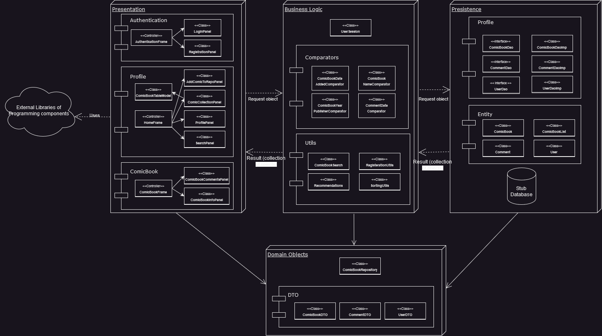

# LongBox ITR02 Build

Your digital solution for archiving and preserving comic books. Developed by passionate fans, this open-source desktop app offers concise documentation for out-of-print, independent, and mainstream comics. Addressing the decline in sales, LongBox provides a user-friendly platform for organizing and archiving collections. With web application plans, it aims to be a central hub for enthusiasts. Users can create profiles, submit comics, and enjoy a recommendation system. Built from scratch, LongBox prioritizes simplicity without relying on existing projects.

## System 

This project uses a 3-layer software architecture. The system is built around the Java Swing framework and behaves as a model view controller application in conformance to the oracle documentation for Swing applications. A sketch of it is:

## Getting Started

### Prerequisites

- The project is built on Java 19.
- The project uses Gradle (Kotlin) as the build system.
- The project used [PostgreSQL 16](https://www.postgresql.org/) as the database.

### Installing

1. The project needs to be cloned into Eclipse from the [GitHub Repository](https://github.com/Hashir-Jamil/LongBox). In terms of ITR01 release, the branch is named iteration_one and in terms of deliverable 1, the branch is main.
2. Once the project has been cloned, gradle nature needs to be added to the project. [How to configure gradle in eclipse](https://www.vogella.com/tutorials/EclipseGradle/article.html#add-gradle-support-to-existing-eclipse-project).
3. To use the database, we need to install [pgAdmin4](https://www.pgadmin.org/download/). In pgAdmin, [create a new database](https://www.tutorialsteacher.com/postgresql/create-database#:~:text=Create%20Database%20using%20pgAdmin&text=Open%20pgAdmin%20and%20right%2Dclick,Database…%20%2C%20as%20shown%20below.&text=This%20will%20open%20Create%20–%20Database,be%20the%20owner%20by%20default). The name of databse should be ***longbox_db***.
4. After creating the database, [run](https://support.spiresystems.com/support/solutions/articles/13000015301-executing-a-sql-query-using-pgadmin) the [*create_longbox_db*](database_scripts/create_longbox_db.sql) in the database_scripts package. This will setup the tables and populate them with the data required for this project.
5. To ensure the database server communicates with the project, go to the file [hibernate.cfg.xml](src/main/resources/hibernate.cfg.xml) and ensure the connection.url property matches the one for your personal machine's postresql installation.

### Testing

The project also consists of a number of test cases, they can be run in Eclipse as follows: 
> right click on src/test/java > RunAs > JUnit Test.

These tests make sure that the business logic that drives our system is working correctly and as expected.We have done a thorough testing such that all the possible edge cases are covered in the test.

## Deployment

To launch the project:
1. Go the presentation package in source.
> LongBox / src / main / java / org / longbox / presntation
2. Go the authentication package inside presentaion.
> LongBox / src / main / java / org / longbox / presntation / authentication
3. Run the _AuthenticationPage.java_ file. This is the primary entry point into the project.

Note:
* This is the first frame of our project, rest of the features can be accessed through this page.
* Inside the persistence package, there is UserStubDB, which can be used to login into the system.

### Build System

[Gradle](https://kotlinlang.org/docs/gradle.html) - Dependency Management

## Features

### Login Page

This is the first page that the user of the app sees.

### Registration Page

New users can sign up and use our app.

### Home Page

This is the first page that the user lands on after logging in the system. The current user's username is displayed near the logout button.
The default view is Comic Repository page where the user can view all the comic books in the app's collection.

### Advanced Search

Users can use the advanced search and search the comics based on Title, Artist, Author, Genre, Publisher and Year Published. The search results are viewed in a different window.

### View Detailed information and Add Comments

After selecting a comic book, users can viewe detailed information about the comic book. In this window user also has an option to add a new comment, view existing comments in order of newest to oldest, 
favorite and unfavorite a book, add and remove a book from a reading and finished list. Comics added to reading and finished list can be viewed in the profile page.

### Add Comic

Using this page, a user can add a comic book to the system. A user can favorite a comic while adding to the system.

### Favorites Page

All the comics favorited are visible in this page, a user can remove a comic from favorites.

Confirmation to remove from favorites:

### View Profile

Users can view their details on the profile page, including comics read and finished. Users also have an option to edit their about me.
This page will show all user profile information except for the password.

### Logout

After using the system, the user can logout and will be redirected to the login page.

## Authors
    Hashir Jamil
    Ahan Bhargava
    Mher Eric Gyuluman
    Ali Sina
    Oscar Ye
