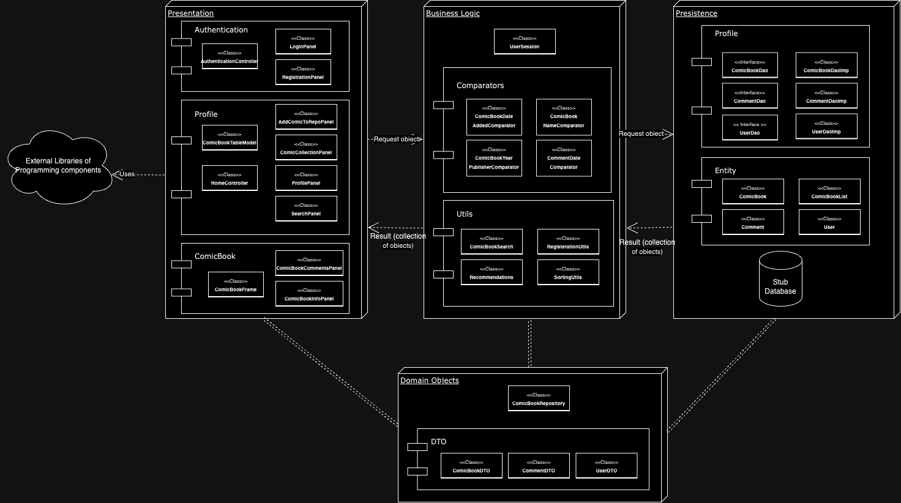

# LongBox

Your digital solution for archiving and preserving comic books. Developed by passionate fans, this open-source desktop app offers concise documentation for out-of-print, independent, and mainstream comics. Addressing the decline in sales, LongBox provides a user-friendly platform for organizing and archiving collections. With web application plans, it aims to be a central hub for enthusiasts. Users can create profiles, submit comics, and enjoy a recommendation system. Built from scratch, LongBox prioritizes simplicity without relying on existing projects.

## System 

This project uses a 3-layer software architechture. A sketch of it is:

## Getting Started

### Prerequisites

- The project is built on Java 19
- The project uses Gradle (Kotlin) as the build system

### Installing

1. The project needs to be cloned into Eclipse.
2. Once the project has been cloned, gradle nature needs to be added to the project. [How to configure grade in eclipse](https://www.vogella.com/tutorials/EclipseGradle/article.html#add-gradle-support-to-existing-eclipse-project).
3. This project also uses [Project Lombok](https://www.baeldung.com/intro-to-project-lombok). Project Lombok can be configured in Eclipse by following [this](https://stackoverflow.com/a/65949629).

### Testing

The project also consists of a number of test cases, they can be run in Eclipse as follows: 
> right click on src/test/java > RunAs > JUnit Test.

These tests make sure that the business logic that drives our system is working correctly and as expected.We have done a thorough testing such that all the possible edge cases are covered in the test.

## Deployment

To launch the project:
1. Go the the presentation package in source.
> LongBox / src / main / java / org / longbox / presntation
2. Go the the authentication package inside presentaion.
> LongBox / src / main / java / org / longbox / presntation / authentication
3. Run the _AuthenticationPage.java_ file

Note:
* This is the first frame of our project, rest features can be accessed through this page.
* Inside the persistence pacakge, there is UserStubDB, which can be used to login into the system.

### Build System

[Gradle](https://kotlinlang.org/docs/gradle.html) - Dependency Management

## Features

### Login Page

This is the first page that the user of the app sees. 

### Registeration Page

New users can sign up and use our app.

### Home Page

This is the first page that the user lands on after logging in the system. The current users username is displayed near the logout button.
The default view isComic Collection page where the user can view all the comic books in the app's collection.

### Add Comic

Using this page, a user can add a comic book to the system.

### Search Comics

Users can search a comic book and if the comic is in the reposisotry, results can be viewed.

### View Profile

Users can view their details on the profile page.

### Logout

After usign the system, the user can logout and will be redirected to the login page.

