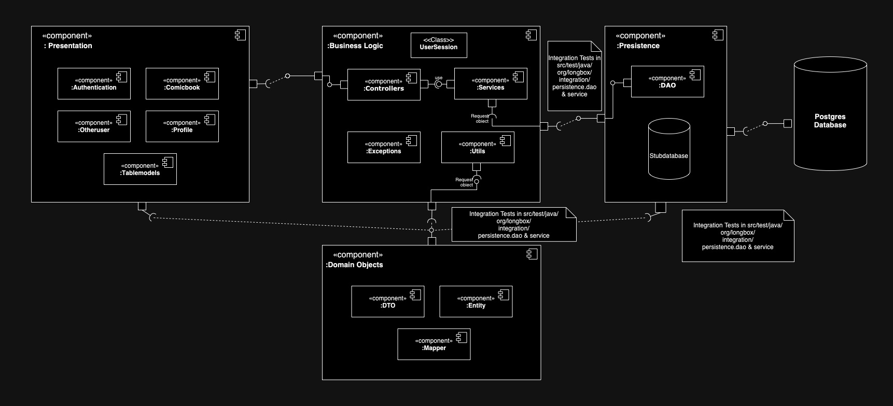

# LongBox ITR03 Build

Your digital solution for archiving and preserving comic books. Developed by passionate fans, this open-source desktop app offers concise documentation for out-of-print, independent, and mainstream comics. Addressing the decline in sales, LongBox provides a user-friendly platform for organizing and archiving collections. With web application plans, it aims to be a central hub for enthusiasts. Users can create profiles, submit comics, and enjoy a recommendation system. Built from scratch, LongBox prioritizes simplicity without relying on existing projects.

## System 

This project uses a 3-layer software architecture. The system is built around the Java Swing framework and behaves as a model view controller application in conformance to the oracle documentation for Swing applications. A sketch of it is:

### Documentation

There are three major documentation types for this project.
1. Several design & planning documents. These have several iterations/revisions and can be found in the [planning directory](design_documents/planning)
2. A [code review document](design_documents/code_review/EECS2311-Z-Team3-TakeHomeAssignment.pdf) that provides peer review done by the team on each other's user stories/features. It provides problem reports, code smells and end-2-end tests for the project.
3. A [refactoring document](design_documents/code_review/Refactoring_Document.pdf) that highlights major design changes in response to code review and problem reports above.
4. [All system diagrams](design_documents/diagrams).

## Getting Started

### Prerequisites

- The project is built on Java 19.
- The project uses Gradle as the build system.
- The project uses [PostgreSQL 16](https://www.postgresql.org/) as the database.

### Installing

1. Clone the [GitHub Repository](https://github.com/Hashir-Jamil/LongBox) delivery-2 branch or download the source for Delivery 2 release.
2. If using eclipse, once the project has been cloned, gradle nature needs to be added to the project. [How to configure gradle in eclipse](https://www.vogella.com/tutorials/EclipseGradle/article.html#add-gradle-support-to-existing-eclipse-project).
3. To use the database, we need [PostgreSQL](https://www.postgresql.org). Run PostgreSQL via command line and create a new database called **longbox_db**.
>  createdb longbox_db; 
4. After creating the database, open the database using 
>  psql -p 5432 -d longbox_db;
5. Once the database view open (you should see longbox_db=# on the left side). Run the following command to load the database (Database script: [create_longbox_db](database_scripts/create_longbox_db.sql)):
>  \i < *path of create_longbox_db.sql* >;
6. To ensure the database server communicates with the project, go to the file [hibernate.cfg.xml](src/main/resources/hibernate.cfg.xml) configuration file and ensure the connection.url property matches the one for your personal machine's PostgreSQL installation and the database made above.

### Build

To build the project run the command:
> gradle clean build

To run the application run the command:
> gradle run 

### Testing

The project uses JUnit and gradle integration for unit testing and integration testing of system code. 
Unit and integration tests are in [test](src/test).
E2E testing is described in the [Code Review Document](design_documents/code_review/EECS2311-Z-Team3-TakeHomeAssignment.pdf) and organized by feature within the document. 

To execute the full JUnit test suite run the command:
> gradle test

To view the coverage of the tests navigate to the [JaCoCo coverage report](build/jacoco-reports/index.html). This must be done after running the test suite.

If using Eclipse, they can all be run as follows: 
> right click on src/test/java > RunAs > JUnit Test.

#### Customer Tests

The video for customer tests can be found [here](https://drive.google.com/file/d/1g3pXuG65CFF6YOEGFZLhamm2C680KwBv/view?usp=share_link).

## Launching in Eclipse IDE

To launch the project:
> Run **Main.java** in *src/main/java*.

### Build System

[Gradle](https://kotlinlang.org/docs/gradle.html) - Dependency Management

# Features

## Login

This is the first page that the user of the app sees.

## Registration

New users can sign up and use our app. Upon sign up users can select preferred genres, using which user will be recommended comics.

## Home

This is the first page that the user lands on after logging in the system. The current user's username is displayed near the logout button. using the top bar, user can navigate and access all the features of the system.

### Recommendations

Upon login users land on a page of recommendations that are tailored to for them. The entries in this list can be opened to explore more about them.

## Comic Repository and Advanced Search

Users can view all the comic books in the app's collection. Users can use the advanced search and search the comics based on Title, Artist, Author, Genre, Publisher and Year Published. The search results are viewed in a different window.

## View Detailed Information

After selecting a comic book, users can view detailed information about the comic book. 

### Add and View Comments

In this window user also has an option to add a new comment, view existing comments in order of newest to oldest. 

### Reading & Finished Lists

Users can add and remove books from their personal reading and finished lists of comic books. Add and remove is accomplished when viewing a comic book in its individual page. The lists can be viewed in the profile view and from here the comic books can be selected again to edit their list membership.

### Comic Ratings

Users can also add ratings to comic books and view them.

## Add Comic

Using this page, a user can add a comic book to the system. A user can favourite a comic while adding to the system.

## Favourite a comic

All the comics favourited are visible in this page, a user can remove a comic from favourites.

Confirmation to remove from favourites:

## View Profile

Users can view their details on the profile page. Users have the option to edit their about me. Users can view the reading and finished comics as a list here.

## Trending

User can view the trending comics of the app, they can also filter it by the Continent.

## Leaderboards

The Social page allows the user to see all the users that use the system. There is also a filter option to filter the results by number of comics read and finished, more or less than a number.

## User Lookup

Using the app, a user can view information about another user such including the comments done by them on comics, their reading and finished list and preferred genres. Users can either double click on a user in the social panel or double click on the comment by a user in the Comic Information page.

## Logout

After using the system, the user can log out and will be redirected to the login page.

## Authors
    Hashir Jamil
    Ahan Bhargava
    Mher Eric Gyuluman
    Ali Sina
    Oscar Ye
